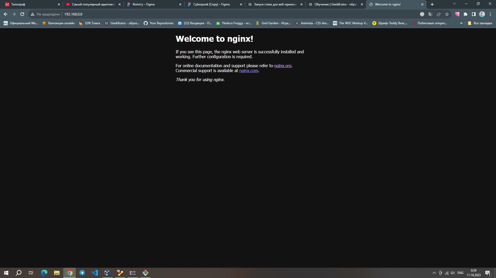
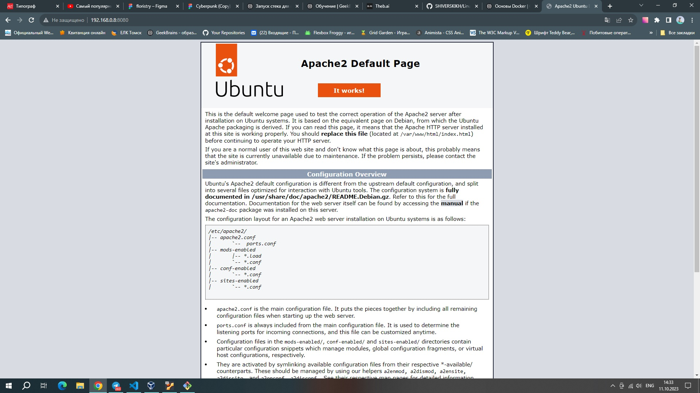
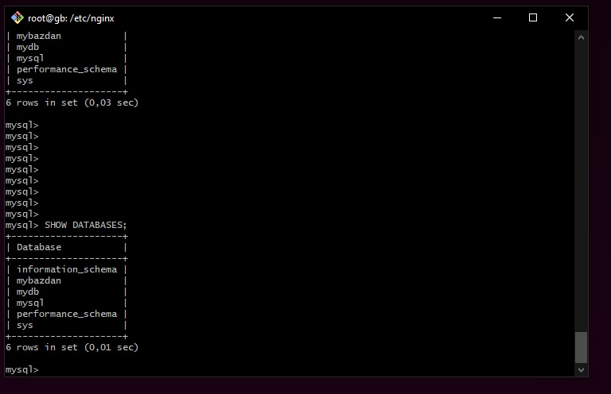

# Задание

• Установить Nginx и настроить его на работу с PHP-FPM.

* sudo apt update
#### Установка:
* sudo apt install nginx
#### Запуск в браузере:

#### Установка пакета PHP:
* sudo apt install php-fpm
#### Редактор файла:
* sudo nano /etc/nginx/sites-available/default
##### Добавления нужных настроек:
            location ~ \.php$ {
    include snippets/fastcgi-php.conf;
    fastcgi_pass unix:/var/run/php/php8.2-fpm.sock;
    fastcgi_param SCRIPT_FILENAME $document_root$fastcgi_script_name;
    include fastcgi_params;
}
#### Перезапуск nginix:
* sudo service nginx restart
#### Перезапуск php:
* sudo service php8.2-fpm restart
#### Переход в директорию:
* cd /var/www/html
#### Создаем файл info.php:
* /var/www/html# touch info.php
#### Редактируем файл:
* /var/www/html# cat > info.php
#### Добавляем php код:
<?php
phpinfo();
?>
• Установить Apache. Настроить обработку PHP. Добиться одновременной работы с Nginx.

* sudo apt-get install apache2
#### Установка необходимых модулей
* sudo apt-get install php libapache2-mod-php
#### Настройка файла 
* sudo nano /etc/apache2/apache2.conf
#### Добавление в конф файл
   AddType application/x-httpd-php .php
#### Настройка портов для одновременной работы с nginx
* sudo nano /etc/apache2/ports.conf
  Listen 8080
#### Перезапуск Apache2
* sudo service apache2 restart

• Настроить схему обратного прокси для Nginx (динамика - на Apache).

#### Переходим в директорию:
*  cd /etc/nginx
#### Редактируем файл конф:
* sudo nano  nginx.conf
  server {
    listen 80;
    server_name example.com;

    location / {
        proxy_pass http://192.168.0.8:8080;
        proxy_set_header Host $host;
        proxy_set_header X-Real-IP $remote_addr;
        proxy_set_header X-Forwarded-For $proxy_add_x_forwarded_for;
    }
  }
#### Перезапуск:
* sudo service nginx restart
#### Проверяем в браузере:

• Установить MySQL. Создать новую базу данных и таблицу в ней.

#### Установка:
* sudo apt-get install mysql-server
### Запуск :
* sudo service mysql start
#### Переход на суперпользователя:
* sudo su
#### Открытие:
* my sql
##### Создаем свою:
* create database mybazdan;
* use mybazdan;

#### Добавления таблицы в нашу базу данных:
* CREATE TABLE my_TAB ( id INT, name VARCHAR(255));

•* Установить пакет phpmyadmin и запустить его веб-интерфейс для управления MySQL.

#### Установка:
* sudo apt-get install phpmyadmin
#### Активация:
* sudo ln -s /etc/phpmyadmin/apache.conf /etc/apache2/conf-enabled/phpmyadmin.conf
#### Перезапуск apache:
* sudo systemctl restart apache2

 

