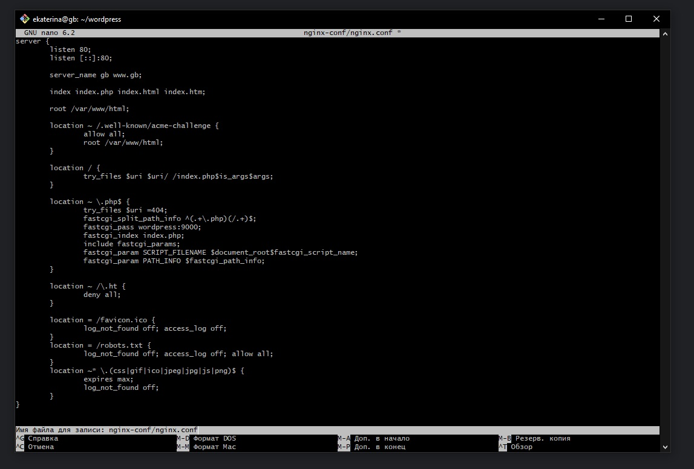
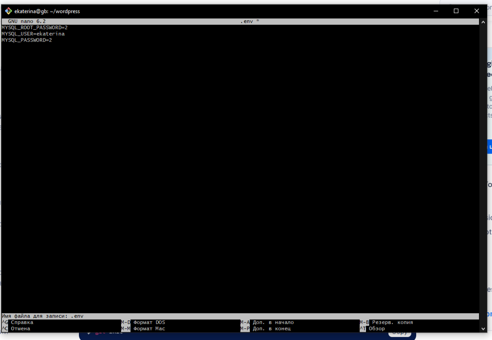
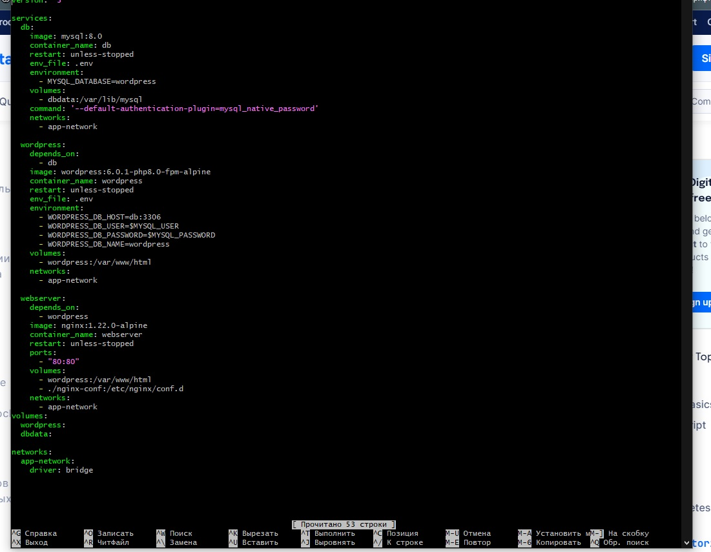
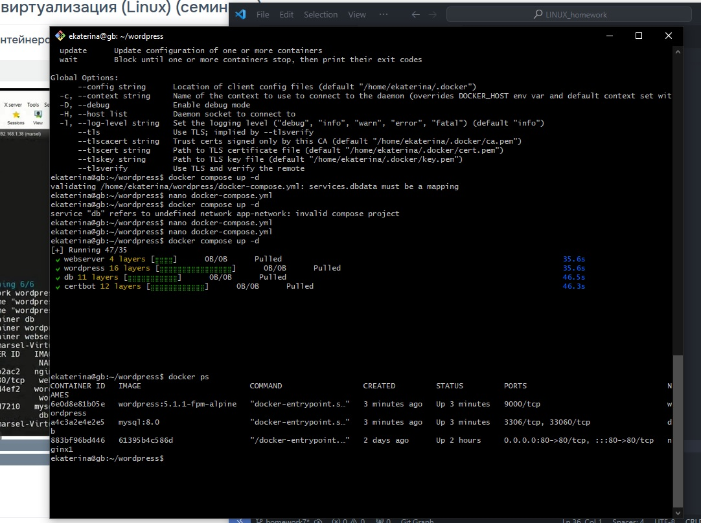
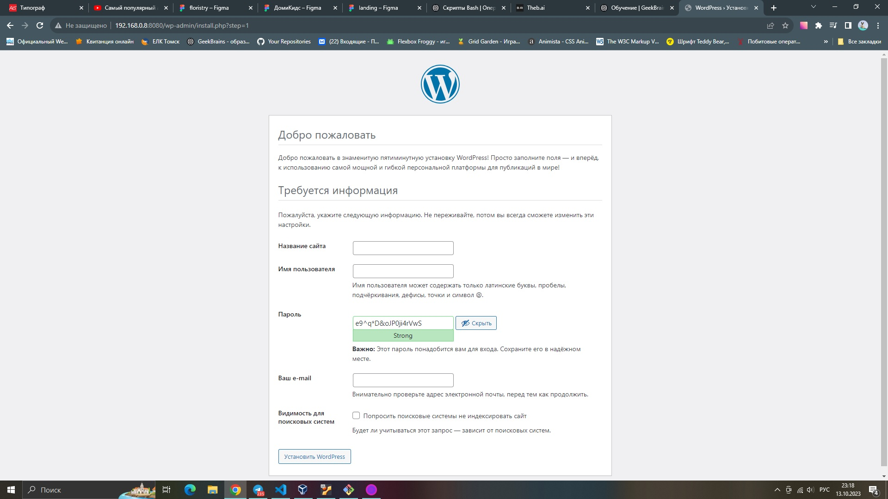
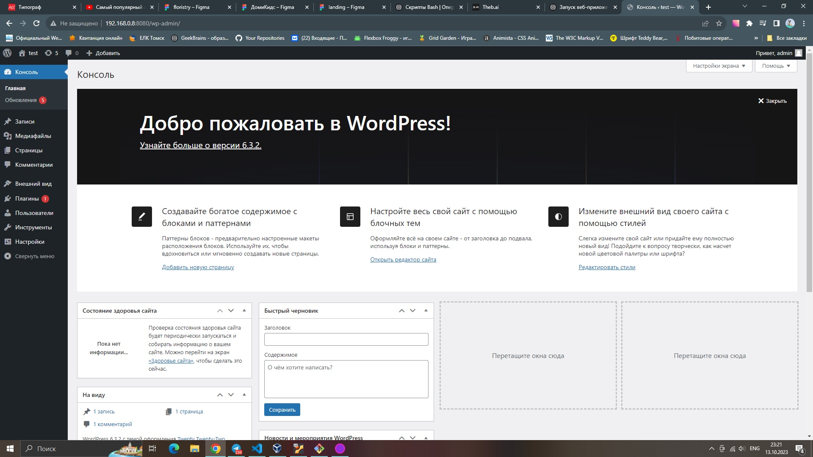
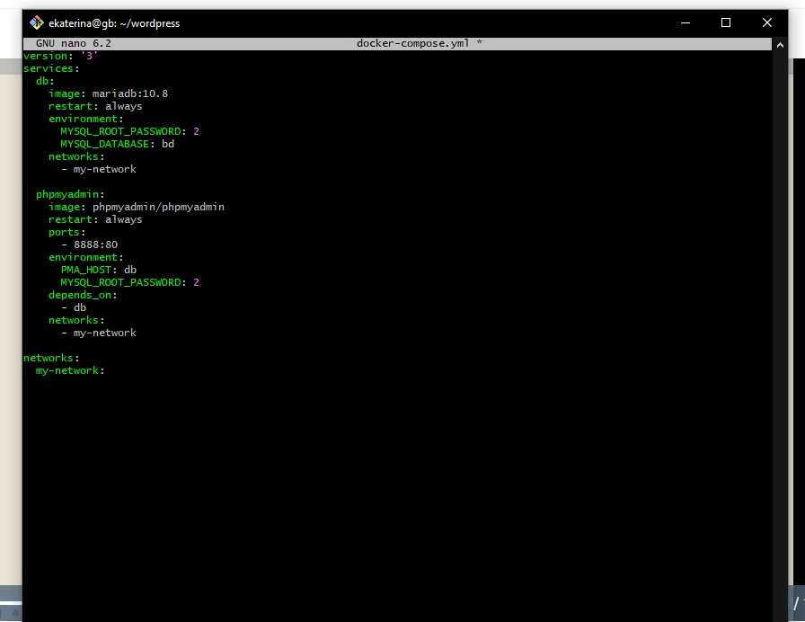
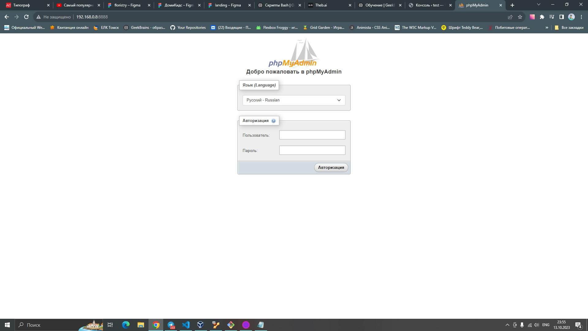

# Задание

• Установить в виртуальную машину или VDS Docker, настроить набор контейнеров через docker compose по инструкции.
Часть с настройкой certbot и HTTPS опустить, если у вас нет настоящего домена и белого IP.

#### Обновляем список пакетов:
* sudo apt update

#### Обновляем список пакетов:
* apt install docker.io
#### Проверка:
* sudo docker
#### Добавьте своего пользователя в группу docker
* sudo usermod -aG docker ekaterina

#### Создаем директорию для настройки и переходим в эту директорию:
* mkdir wordpress && cd wordpress

#### Затем создаём директорию для файла конфигурации:
* mkdir nginx-conf

#### Открываем файл и редактируем:
* nano nginx-conf/nginx.conf

#### Открываем файл для редактирования:
* nano .env 

#### Открываем файл для редактирования:
* nano docker-compose.yml

*  docker-compose up -d --force-recreate --no-deps webserver
* docker compose up -d

#### Проверяем:
* docker ps

#### Открываем в браузере:

• Запустить два контейнера, связанные одной сетью (используя документацию).
Первый контейнер БД (например, образ mariadb:10.8), второй контейнер — phpmyadmin.
Получить доступ к БД в первом контейнере через второй контейнер (веб-интерфейс phpmyadmin).

#### Открываем файл для редактирования:
* nano docker-compose.yml

* docker compose up -d

#### Открываем в браузере:

